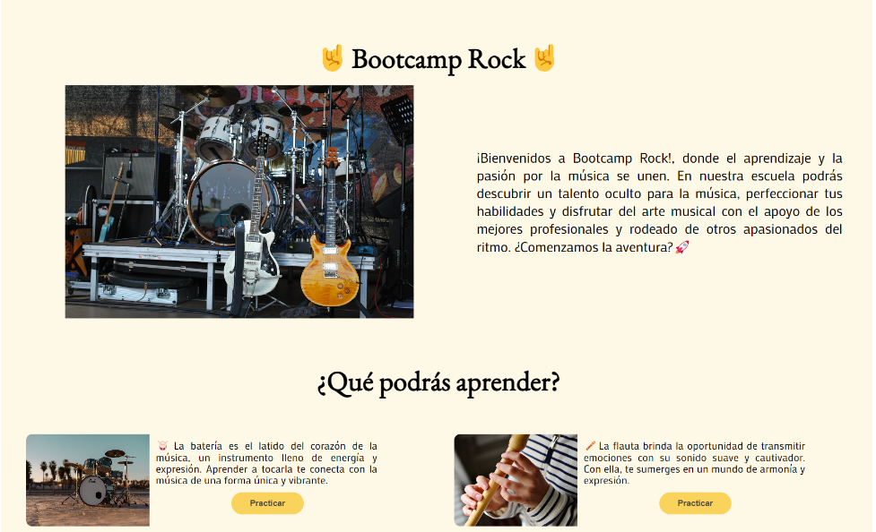

# 🤟 Bootcamp Rock 🤟  

## 🎸 Bienvenidos a la revolución musical 🎶  

¡Hola, rockstars! 🤘 Bienvenidos a **Bootcamp Rock**, una escuela de música virtual donde podrás **probar instrumentos de forma interactiva y aprender sobre música**. Aquí la pasión por el ritmo y la melodía se fusiona con la tecnología para brindarte una experiencia única. 

💡 ¿Tienes talento oculto? ¡Descúbrelo! ¿Quieres mejorar tus habilidades? ¡Perfecciónalas! Todo con el apoyo de **los mejores profesionales y rodeado de otros amantes de la música**. 🎼✨

🚀 **¿Listo para comenzar esta aventura sonora?** 

---

## 🛠️ Tecnologías utilizadas  


Para dar vida a esta increíble experiencia, usamos:  


 → Para diseñar la interfaz más rockera </br>
 → Para estructurar y estilizar la plataforma  </br>
 → Para hacer que todo cobre vida de manera interactiva  </br>

 → El entorno de desarrollo más amigable </br>
  → Para ordenar todo el trabajo en equipo (lo más importante)  </br>

___
### 👀 Echa un ojo al Figma de Bootcamp Rock ⤵️
[Proyecto Figma](https://www.figma.com/design/L7S4PGTmSc6M8rhxi1Mt04/Bootcamp-Rock?node-id=112-20&t=9BXjY8GYlvG1102e-1)


### 🖼️ Una vista de nuestra web
  

### 🎞️ ¡Nuestro Bamba rockeando en el piano de la web!

  

---

## 🏁 ¿Quieres robar nuestro código? Róbalo tranquilo. Hasta te damos los pasos: 

1. 📥 Clona el repositorio:  
   ```bash
   git clone [https://github.com/diegodistefano/Tocando_el_DOM.git]
2. 📂 Entra en la carpeta del proyecto:  
   ```bash
   cd Tocando_el_DOM
   ```
3. 🚀 Abre el archivo `index.html` en tu navegador favorito y ¡a rockear! 🎶

---

## 👥 Nuestro equipo  

Este proyecto fue desarrollado con mucho ritmo por:  
- 🎸 **Rubén** - Maestro de la guitarra y el código    [](https://www.linkedin.com/in/rubenortegagonzalez/)
- 🎤 **José** - El vocalista del frontend    [](https://www.linkedin.com/in/jose-manuel-barreiro-álvarez/)  
- 🥁 **Diego** - Baterista del backend    [](https://www.linkedin.com/in/diegodistefano/)
- 🎹 **Saray** - Pianista del diseño UI/UX    [](https://www.linkedin.com/in/saray-miguel-narganes/)  

👨‍💻👩‍💻 ¡Gracias por hacer de Bootcamp Rock una realidad! 🤘

---

## 📜 Licencia  

Este proyecto está bajo la licencia **ROBE TRANQUIL@**. ¡Úsalo, mejóralo y comparte el rock! 🎵  

---

## 📢 ¡Síguenos y colabora!  

Si te gusta este proyecto, dale ⭐ en GitHub y únete a nuestra comunidad. ¡Aceptamos sugerencias, mejoras y colaboraciones!  

Aceptamos Patreon, Bizum, y PayPal.

¡Nos vemos en el escenario digital! 🎤🔥
